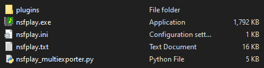
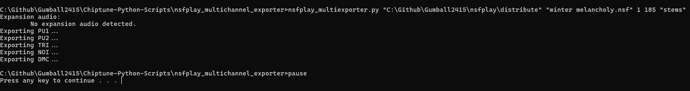

# NSFPlay Multichannel Exporter

A quick and dirty multichannel exporter for NSFPlay, built on version 2.5, compatible with version 2.4.
Place the script in the NSFPlay folder, making sure it's next to `nsfplay.exe` and the `plugins` folder.



Note that this will generate tracks with nonlinear distortion, so make sure your configurations are set to deterministic settings (i.e. no random triangle phase, no random noise phase, etc.)



[Example oscilloscope video using the output files](https://youtu.be/71gAf07z7e4)

```
usage: nsfplay_multiexporter.py [-h] [-v] [-nch N163CHANNELS] inputnsf nsftrack wavlength outputwav

NSFPlay Channel Exporter by Persune

positional arguments:
  inputnsf              NSF file input
  nsftrack              Track of .nsf
  wavlength             Length of .wav export in seconds
  outputwav             WAV Export name

optional arguments:
  -h, --help            show this help message and exit
  -v, --verbose         Enable output verbosity
  -nch N163CHANNELS, --n163channels N163CHANNELS
                        Specify number of N163 channels. Default is 8

version beta 0.4
```

