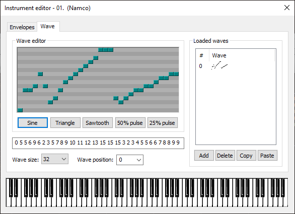
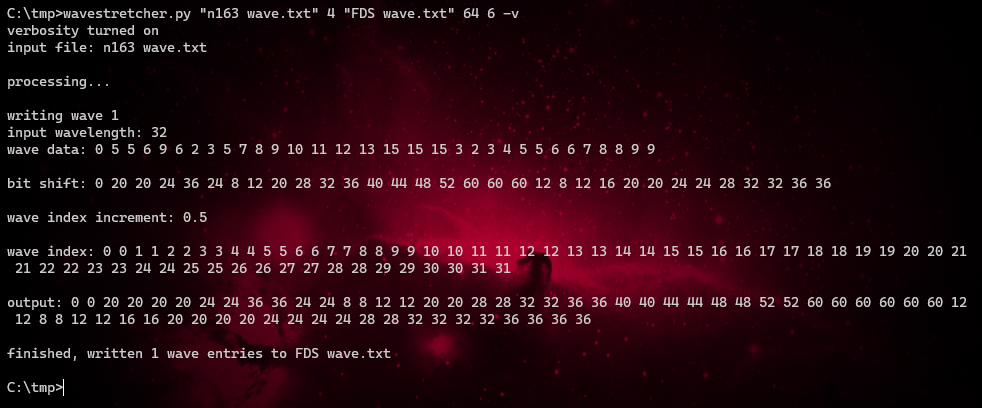
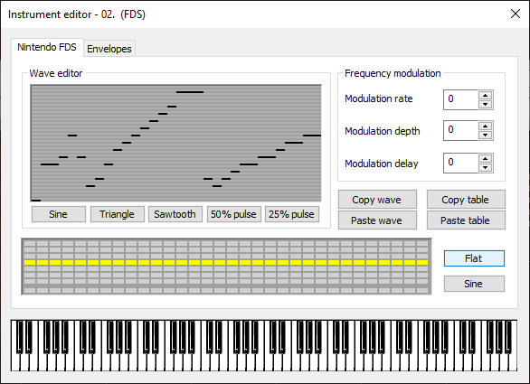

# Wavestretcher

it stretches waves

---

## About

A crusty, no-interpolation wavetable converter. Converts mml wavetable data from one format to another.

## Example

Converting from N163 wavetable data to FDS wavetable data:



 

## Usage

```
usage: wavestretcher.py [-h] [-v] input_txt input_depth output_txt output_length output_depth

A crusty, no-interpolation wavetable converter. Converts mml wavetable data from one format to another.

positional arguments:
  input_txt      input text file containing mml formatted wavetable data, seperated by line breaks.
  input_depth    input bit depth of wavetable data.
  output_txt     output text file containing mml formatted wavetable data, seperated by line breaks.
  output_length  output wavelength of wavetable data.
  output_depth   output bit depth of wavetable data.

optional arguments:
  -h, --help     show this help message and exit
  -v, --verbose  enable verbose debug messages

version beta 0.1
```

## License

Licensed under the MIT-0 license. Copyright 2021-2024 Persune.
